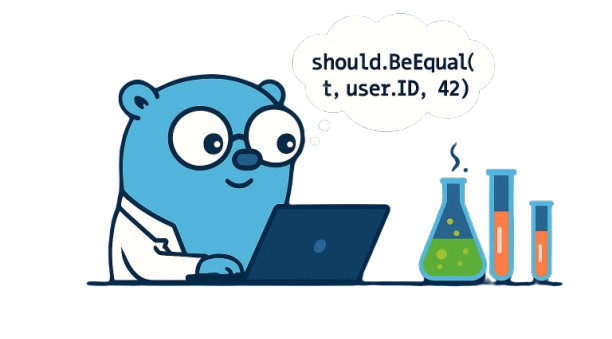

# Should - A Go Assertion Library

[](https://golang.com/)
[](https://pkg.go.dev/github.com/Kairum-Labs/should)
[](https://codecov.io/gh/Kairum-Labs/should)
[](https://goreportcard.com/report/github.com/Kairum-Labs/should)
[](https://opensource.org/licenses/MIT)

<div align="center">
  
</div>

`Should` is a lightweight and intuitive assertion library for Go, designed to make your tests more readable and expressive. It provides **exceptionally detailed error messages** to help you debug failures faster and understand exactly what went wrong.

> **⚠️ Version Notice**: This is v0.1.0 - the library is fully usable and functional, but the API may still undergo changes as we gather feedback and improve the design.

## Features

- **Detailed Error Messages**: Get comprehensive, contextual error information for every assertion type.
- **Smart String Handling**: Automatic multiline formatting for long strings and truncation with context.
- **Numeric Comparisons**: Detailed difference calculations with helpful hints for numeric assertions.
- **Time Comparisons**: Compare times with options to ignore timezone and/or nanoseconds with clear diffs.
- **Empty/Non-Empty Checks**: Rich context about collection types, sizes, and content.
- **String Similarity**: When a string assertion fails, `Should` suggests similar strings from your collection to help you spot typos.
- **Numeric Context**: When a numeric assertion fails, `Should` shows nearby values in the collection to help you reason about missing or unexpected numbers.
- **Type-Safe**: Uses Go generics for type safety while maintaining a clean API.

## Installation

**Requirements:** Go 1.22 or later

```bash
go get github.com/Kairum-Labs/should
```

## Quick Start

```go
package main

import (
	"testing"
	"github.com/Kairum-Labs/should"
)

func TestBasicAssertions(t *testing.T) {
	// Boolean assertions
	should.BeTrue(t, true)
	should.BeFalse(t, false)

	// Equality checks
	should.BeEqual(t, "hello", "hello")
	should.BeEqual(t, 42, 42)

	// Numeric comparisons
	should.BeGreaterThan(t, 10, 5)
	should.BeLessThan(t, 3, 7)
	should.BeLessOrEqualTo(t, 5, 10)

	// Range validation
	should.BeInRange(t, user.Age, 18, 65)
	should.BeInRange(t, testScore, 0, 100)
	should.BeInRange(t, response.StatusCode, 200, 299)

	// Time comparisons
	should.BeSameTime(t, t1, t2)
	should.BeSameTime(t, t1, t2, should.WithIgnoreTimezone())
	should.BeSameTime(t, t1, t2, should.WithTruncate(time.Second))

	// Numeric comparisons with custom messages
	should.BeGreaterThan(t, user.Age, 18, should.WithMessage("User must be adult"))
	should.BeGreaterOrEqualTo(t, score, 0, should.WithMessage("Score cannot be negative"))
	should.BeLessOrEqualTo(t, user.Age, 65, should.WithMessage("User must be under retirement age"))

	// Empty/Non-empty checks
	should.BeEmpty(t, "")
	should.NotBeEmpty(t, []int{1, 2, 3})

	// String operations
	should.StartWith(t, "Hello, World!", "Hello")
	should.EndWith(t, "Hello, World!", "World!")
	should.ContainSubstring(t, "Hello, World!", "World")

	// Collection operations
	users := []string{"Alice", "Bob", "Charlie"}
	should.Contain(t, users, "Alice")
	should.NotContain(t, users, "David")
	should.Contain(t, userIDs, targetID, should.WithMessage("User ID must exist in the system"))

	// Sort check
	should.BeSorted(t, []int{1, 2, 3, 4, 5})
	should.BeSorted(t, []string{"apple", "banana", "cherry"})
	should.BeSorted(t, scores, should.WithMessage("Test scores must be in ascending order"))
}
```

## Detailed Error Messages

### Empty/Non-Empty Assertions

`Should` provides rich context for empty and non-empty checks:

```go
// Short string
should.BeEmpty(t, "Hello World!")
// Output:
// Expected value to be empty, but it was not:
//         Type    : string
//         Length  : 12 characters
//         Content : "Hello World!"

// Long string (automatically formatted)
longText := "Lorem ipsum dolor sit amet, consectetur adipiscing elit..."
should.BeEmpty(t, longText)
// Output:
// Length: 516 characters, 9 lines
// 1. Lorem ipsum dolor sit amet, consectetur adipiscing elit.
// 2.  Sed do eiusmod tempor incididunt ut labore et dolore ma
// 3. gna aliqua. Ut enim ad minim veniam, quis nostrud exerci
// 4. tation ullamco laboris nisi ut aliquip ex ea commodo con
// 5. sequat. Duis aute irure dolor in reprehenderit in volupt
//
// Last lines:
// 7. xcepteur sint occaecat cupidatat non proident, sunt in c
// 8. ulpa qui officia deserunt mollit anim id est laborum. Vi
// 9. vamus sagittis lacus vel augue laoreet rutrum faucibus d

// Large slice (shows truncated content)
largeSlice := []int{1, 2, 3, 4, 5, 6, 7, 8, 9, 10, 11, 12, 13, 14, 15}
should.BeEmpty(t, largeSlice)
// Output:
// Expected value to be empty, but it was not:
//         Type    : []int
//         Length  : 15 elements
//         Content : [1, 2, 3, ...] (showing first 3 of 15)

// Empty slice
should.NotBeEmpty(t, []int{})
// Output:
// Expected value to be not empty, but it was empty:
//         Type    : []int
//         Length  : 0 elements
```

### Numeric Comparisons

Get detailed information about numeric comparison failures:

```go
// Basic comparison with custom message
should.BeGreaterThan(t, 5, 10, should.WithMessage("Score validation failed"))
// Output:
// Score validation failed
// Expected value to be greater than threshold:
//         Value     : 5
//         Threshold : 10
//         Difference: -5 (value is 5 smaller)
//         Hint   : Value should be larger than threshold

// Equal values
should.BeGreaterThan(t, 42, 42)
// Output:
// Expected value to be greater than threshold:
//         Value     : 42
//         Threshold : 42
//         Difference: 0 (values are equal)
//         Hint   : Value should be larger than threshold

// Float precision
should.BeLessThan(t, 3.14, 2.71)
// Output:
// Expected value to be less than threshold:
//         Value     : 3.14
//         Threshold : 2.71
//         Difference: +0.43000000000000016 (value is 0.43000000000000016 greater)
//         Hint   : Value should be smaller than threshold

// Large numbers
should.BeLessThan(t, 1000000, 999999)
// Output:
// Expected value to be less than threshold:
//         Value     : 1000000
//         Threshold : 999999
//         Difference: +1 (value is 1 greater)
//         Hint   : Value should be smaller than threshold

// Less than or equal (fails when value is greater)
should.BeLessOrEqualTo(t, 15, 10)
// Output:
// Expected value to be less than or equal to threshold:
//         Value     : 15
//         Threshold : 10
//         Difference: +5 (value is 5 greater)
//         Hint      : Value should be smaller than or equal to threshold

// Fails because 3.142 is not within ±0.001 of 3.140.
should.BeWithin(t, 3.142, 3.14, 0.001)
//Expected value to be within ±0.001000 of 3.140000, but it was not:
//    Actual    : 3.142000
//    Expected  : 3.140000
//    Difference: ±0.001000
//    Tolerance : 0.002000 (100.00% greater than tolerance)

// Range validation (fails when value is below or above the range)
should.BeInRange(t, 16, 18, 65)
// Output:
// Expected value to be in range [18, 65], but it was below:
//         Value    : 16
//         Range    : [18, 65]
//         Distance : 2 below minimum (16 < 18)
//         Hint     : Value should be >= 18

// Range validation (fails when value is above the range)
should.BeInRange(t, 105, 0, 100)
// Output:
// Expected value to be in range [0, 100], but it was above:
//         Value    : 105
//         Range    : [0, 100]
//         Distance : 5 above maximum (105 > 100)
//         Hint     : Value should be <= 100

// Range validation with custom message
should.BeInRange(t, 150, 0, 100, should.WithMessage("Battery level must be valid percentage"))
// Output:
// Battery level must be valid percentage
// Expected value to be in range [0, 100], but it was above:
//         Value    : 150
//         Range    : [0, 100]
//         Distance : 50 above maximum (150 > 100)
//         Hint     : Value should be <= 100
```

### Struct and Object Comparisons

When comparing complex objects, `Should` shows exactly what differs:

```go
type Person struct {
    Name string
    Age  int
}

p1 := Person{Name: "John", Age: 30}
p2 := Person{Name: "Jane", Age: 25}
should.BeEqual(t, p1, p2)

// Output:
// Differences found:
// Not equal:
// expected: {Name: "Jane", Age: 25}
// actual  : {Name: "John", Age: 30}
//
// Field differences:
//   └─ Name: "Jane" ≠ "John"
//   └─ Age: 25 ≠ 30

// Ensure values are NOT equal
p3 := Person{Name: "John", Age: 30}
should.NotBeEqual(t, p1, p3)
// Output when values are equal:
// Expected values to be different, but they are equal
```

### Length and Type Assertions

Get clear feedback on length and type mismatches.

```go
// Incorrect length
should.HaveLength(t, []string{"apple", "banana"}, 3)
// Output:
// Expected collection to have specific length:
// Type          : []string
// Expected Length: 3
// Actual Length : 2
// Difference    : -1 (1 element(s) missing)

// Incorrect type
type Dog struct{ Name string }
type Cat struct{ Name string }
var d Dog
should.BeOfType(t, Cat{Name: "Whiskers"}, d)
// Output:
// Expected value to be of specific type:
// Expected Type: should_test.Dog
// Actual Type  : should_test.Cat
// Difference   : Different concrete types
```

### String Similarity Detection

When checking for strings in slices, `Should` helps you find typos:

```go
users := []string{"user-one", "user_two", "UserThree", "user-3", "userThree"}
should.Contain(t, users, "user3")

// Output includes helpful suggestions:
// Expected collection to contain element:
//         Collection: [user-one, user_two, UserThree, user-3, userThree]
//         Missing   : user3
//
//           Similar elements found:
//           └─ user-3 (at index 3) - 1 extra char
//           └─ userThree (at index 4) - case difference
```

### Numeric Context Information

When checking for numeric in slices, `Should` shows where the value would fit:

```go
numbers := []int{10, 80, 20, 70, 30, 60, 40, 50, 0, 100, 90, 120, 110} // 13 elements, unsorted
should.Contain(t, numbers, 55)

// Output includes context information:
// Expected collection to contain element:
// Collection: [10, 80, 20, 70, 30, ..., 90, 120, 110] (showing first 5 and last 5 of 13 elements)
// Missing   : 55
//
// Element 55 would fit between 50 and 60 in sorted order
// └─ Sorted view: [..., 40, 50, 60, 70, ...]
```

### Set Membership Assertions

Check if a value is part of a set of allowed options.

```go
should.BeOneOf(t, "pending", []string{"active", "inactive", "suspended"})
// Output:
// Expected value to be one of the allowed options:
// Value   : "pending"
// Options : ["active", "inactive", "suspended"]
// Count   : 0 of 3 options matched
```

### String Prefix and Suffix Assertions

Check if strings start or end with specific substrings, with intelligent case handling:

```go
// Basic string prefix checking
should.StartWith(t, "Hello, World!", "Hello")

// Case-sensitive by default
should.StartWith(t, "Hello, World!", "hello")
// Output:
// Expected string to start with 'hello', but it starts with 'Hello'
// Expected : 'hello'
// Actual   : 'Hello, World!'
//             ^^^^^
//           (actual prefix)
// Note: Case mismatch detected (use should.WithIgnoreCase() if intended)

// Case-insensitive option
should.StartWith(t, "Hello, World!", "hello", should.WithIgnoreCase())

// String suffix checking
should.EndWith(t, "Hello, World!", "World!")

// With custom messages
should.StartWith(t, filename, "temp_", should.WithMessage("Temporary files must have temp_ prefix"))
should.EndWith(t, filename, ".log", should.WithMessage("Log files must have .log extension"))
```

### String Substring Assertions

Check if strings contain specific substrings, with intelligent formatting for long strings:

```go
// Basic substring checking
should.ContainSubstring(t, "Hello, World!", "World")

// Case-sensitive by default
should.ContainSubstring(t, "Hello, World!", "world")
// Output:
// Expected string to contain 'world', but it was not found
// Substring   : 'world'
// Actual   : 'Hello, World!'
// Note: Case mismatch detected (use should.WithIgnoreCase() if intended)

// Case-insensitive option
should.ContainSubstring(t, "Hello, World!", "world", should.WithIgnoreCase())

// Typo detection for short substrings (≤20 characters)
should.ContainSubstring(t, "Hello, beautiful world!", "beatiful")
// Output:
// Expected string to contain 'beatiful', but it was not found
// Substring   : 'beatiful'
// Actual   : 'Hello, beautiful world!'
//
// Similar substring found:
//   └─ 'beautiful' at position 7 - 1 char diff

// Multiple similar matches
should.ContainSubstring(t, "test testing tester", "tets")
// Output:
// Expected string to contain 'tets', but it was not found
// Substring   : 'tets'
// Actual   : 'test testing tester'
//
// Similar substrings found:
//   └─ 'test' at position 0 - 1 char diff
//   └─ 'test' at position 5 - 1 char diff

// Long strings with multiline formatting
longText := `This is a very long text that spans multiple lines
and contains various keywords and phrases that we might
want to search for in our test assertions.`

should.ContainSubstring(t, longText, "nonexistent")
// Output:
// Expected string to contain 'nonexistent', but it was not found
// Substring   : 'nonexistent'
// Actual   : (length: 153)
// 1. This is a very long text that spans multiple lines
// 2. and contains various keywords and phrases that we might
// 3. want to search for in our test assertions.

// With custom messages
should.ContainSubstring(t, logContent, "ERROR", should.WithMessage("Log should contain error messages"))
should.ContainSubstring(t, apiResponse, "success", should.WithIgnoreCase(), should.WithMessage("API response should indicate success"))
```

**Note**: Typo detection using Levenshtein distance is automatically enabled for substrings up to 20 characters to maintain good performance. For longer substrings, only exact matching is performed.

### Duplicate Detection

Ensure collections contain no duplicate values with detailed reporting:

```go
// Check for duplicates in slices
should.NotContainDuplicates(t, []int{1, 2, 3, 4, 5}) // passes

should.NotContainDuplicates(t, []int{1, 2, 2, 3, 3, 3})
// Output:
// Expected no duplicates, but found 2 duplicate values:
// └─ 2 appears 2 times at indexes [1, 2]
// └─ 3 appears 3 times at indexes [3, 4, 5]
```

### Error Assertions

Handle error check with clear, informative messages:

```go
// Basic usage
should.BeError(t, err)
should.NotBeError(t, err)

// Check specific error types
var pathErr *os.PathError
should.BeErrorAs(t, err, &pathErr)

// Check specific error values
should.BeErrorIs(t, err, io.EOF)

// With custom messages
should.BeError(t, err, should.WithMessage("Expected operation to fail"))
should.NotBeError(t, err, should.WithMessage("Expected operation to pass"))
should.BeErrorAs(t, err, &pathErr, should.WithMessage("Expected path error"))
should.BeErrorIs(t, err, context.Canceled, should.WithMessage("Expected cancellation"))

// Outputs
// BeError - error required
should.BeError(t, err)
// Expected an error, but got nil

// NotBeError - no error
should.NotBeError(t, err)
// Expected no error, but got an error
// Error: "something went wrong"
// Type: *errors.errorString


// BeErrorAs - type not found
var pathErr *os.PathError
should.BeErrorAs(t, err, &pathErr)
// Expected error to be *os.PathError, but type not found in error chain
// Error: "invalid character 'i' looking for beginning of value"
// Types: [*json.SyntaxError]

// BeErrorIs - value not found
should.BeErrorIs(t, err, io.EOF)
// Expected error to be "EOF", but value not found in error chain
// Error: "connection refused"
// Types: [*net.OpError, syscall.Errno]
```

### Time Assertions

Compare times with flexible options:

```go
// Basic usage
should.BeSameTime(t, actual, expected)

// With custom messages
should.BeSameTime(t, actual, expected, should.WithMessage("Expected times to match but they differ"))

// With options
should.BeSameTime(t, actual, expected,
    should.WithIgnoreTimezone(),
    should.WithTruncate(time.Second),
)

time1 := time.Date(2024, 1, 15, 14, 30, 0, 0, time.UTC)
time2 := time.Date(2024, 1, 15, 14, 30, 2, 500000000, time.UTC)

should.BeSameTime(t, time1, time2)
// Expected times to be the same, but difference is 2.5s
// Expected: 2024-01-15 14:30:00.000000000 UTC
// Actual  : 2024-01-15 14:30:02.500000000 UTC (2.5s later)

should.BeSameTime(t, time2, time1)
// Expected times to be the same, but difference is 2.5s
// Expected: 2024-01-15 14:30:02.500000000 UTC
// Actual  : 2024-01-15 14:30:00.000000000 UTC (2.5s earlier)

// Ignore timezone differences
utc := time.Date(2024, 1, 15, 14, 30, 0, 0, time.UTC)
est := time.Date(2024, 1, 15, 9, 30, 0, 0, time.FixedZone("EST", -5*3600))
should.BeSameTime(t, utc, est, should.WithIgnoreTimezone()) // Pass
```

### Sorted Check

Verify that collections are sorted in ascending order with detailed violation reporting:

```go
// Multiple violations with helpful summary
should.BeSorted(t, []int{5, 4, 3, 2, 1})
// Output:
// Expected collection to be in ascending order, but it is not:
// Collection: (total: 5 elements)
// Status    : 4 order violations found
// Problems  :
//   - Index 0: 5 > 4
//   - Index 1: 4 > 3
//   - Index 2: 3 > 2
//   - Index 3: 2 > 1

// Large collections with truncation (stops after 6 violations for performance)
should.BeSorted(t, []int{10, 9, 8, 7, 6, 5, 4, 3, 2, 1, 0})
// Output:
// Expected collection to be in ascending order, but it is not:
// Collection: (total: 11 elements)
// Status    : 6 order violations found
// Problems  :
//   - Index 0: 10 > 9
//   - Index 1: 9 > 8
//   - Index 2: 8 > 7
//   - Index 3: 7 > 6
//   - Index 4: 6 > 5
//   - ... and 1 more violation

// Very large collections with special formatting
should.BeSorted(t, largeSlice)
// Output:
// Expected collection to be in ascending order, but it is not:
// Collection: [Large collection] (total: 10000 elements)
// Status    : 3 order violations found
// Problems  :
//   - Index 4567: 123 > 115
//   - Index 4702: 890 > 456
//   - Index 4833: 234 > 111

should.BeSorted(t, []string{"banana", "apple", "cherry"})
// Output:
// Expected collection to be in ascending order, but it is not:
// Collection: (total: 3 elements)
// Status    : 1 order violation found
// Problems  :
//   - Index 0: banana > apple

// With custom messages
should.BeSorted(t, testScores, should.WithMessage("Test scores must be in ascending order"))
should.BeSorted(t, timestamps, should.WithMessage("Events must be chronologically ordered"))
```

### Map Key and Value Assertions

Check if maps contain specific keys or values with intelligent similarity detection:

```go
userMap := map[string]int{
    "name": 1,
    "age":  2,
    "email": 3,
}

// Check for map keys
should.ContainKey(t, userMap, "name") // passes
should.ContainKey(t, userMap, "phone")
// Output:
// Expected map to contain key 'phone', but key was not found
// Available keys: ['name', 'age', 'email']
// Missing: 'phone'

// Check for map values
should.ContainValue(t, userMap, 2) // passes
should.ContainValue(t, userMap, 5)
// Output:
// Expected map to contain value 5, but value was not found
// Available values: [1, 2, 3]
// Missing: 5

// With typo detection for string keys
should.ContainKey(t, userMap, "nam")
// Output:
// Expected map to contain key 'nam', but key was not found
// Available keys: ['name', 'age', 'email']
// Missing: 'nam'
//
// Similar key found:
//   └─ 'name' - 1 missing char

// Numeric maps with similarity
scoreMap := map[int]string{1: "first", 2: "second", 10: "tenth"}
should.ContainKey(t, scoreMap, 9)
// Output:
// Expected map to contain key 9, but key was not found
// Available keys: [1, 2, 10]
// Missing: 9
//
// Similar key found:
//   └─ 10 - differs by 1

// With custom messages
should.ContainKey(t, config, "database_url", should.WithMessage("Database URL must be configured"))
should.ContainValue(t, statusCodes, 200, should.WithMessage("Success status code must be present"))

// Check that maps do NOT contain specific keys or values
should.NotContainKey(t, userMap, "password") // passes if 'password' key is not present
should.NotContainValue(t, userMap, 999) // passes if value 999 is not found

// When key is found in NotContainKey
should.NotContainKey(t, userSettings, "admin_access")
// Output when key is found:
// Expected map to NOT contain key, but it was found:
// Map Type : map[string]string
// Map Size : 3 entries
// Found Key: "admin_access"
// Found Value: "true"

// When value is found in NotContainValue
should.NotContainValue(t, userRoles, 3)
// Output when value is found:
// Expected map to NOT contain value, but it was found:
// Map Type : map[string]int
// Map Size : 3 entries
// Found Value: 3
// Found At: key "admin"
```

## API Reference

### Core Assertions

- `BeTrue(t, actual)` / `BeFalse(t, actual)` - Boolean value checks
- `BeEqual(t, actual, expected)` - Deep equality comparison with detailed diffs
- `NotBeEqual(t, actual, unexpected)` - Ensure two values are not equal
- `BeNil(t, actual)` / `NotBeNil(t, actual)` - Nil pointer checks
- `BeOfType(t, actual, expected)` - Checks if a value is of a specific type
- `BeSameTime(t, actual, expected, options...)` - Compare times with optional timezone/nanosecond ignoring
- `HaveLength(t, collection, length)` - Checks if a collection has a specific length

### Empty/Non-Empty Checks

- `BeEmpty(t, actual)` - Checks if strings, slices, arrays, maps, channels, or pointers are empty
- `NotBeEmpty(t, actual)` - Checks if values are not empty

### Numeric Comparisons

- `BeGreaterThan(t, actual, threshold)` - Numeric greater-than comparison
- `BeLessThan(t, actual, threshold)` - Numeric less-than comparison
- `BeGreaterOrEqualTo(t, actual, threshold)` - Numeric greater-than-or-equal comparison
- `BeLessOrEqualTo(t, actual, threshold)` - Numeric less-than-or-equal comparison
- `BeInRange(t, actual, minValue, maxValue)` - Check if value is within inclusive range [minValue, maxValue]
- `BeWithin(t, actual, expected, tolerance)` - Check if numeric value is within the given tolerance of the expected value

### String Operations

- `StartWith(t, actual, expected)` - Check if string starts with expected substring
- `EndWith(t, actual, expected)` - Check if string ends with expected substring
- `ContainSubstring(t, actual, substring)` - Check if string contains expected substring

### Collection Operations

- `BeOneOf(t, actual, options)` - Check if a value is one of a set of options
- `Contain(t, collection, element)` - Check if slice/array contains an element
- `NotContain(t, collection, element)` - Check if slice/array does not contain an element
- `NotContainDuplicates(t, collection)` - Check if slice/array contains no duplicate values
- `AnyMatch(t, collection, predicate)` - Check if any element matches a custom predicate
- `BeSorted(t, slice)` - Check if slice is sorted in ascending order (supports numeric types and strings)

### Map Operations

- `ContainKey(t, map, key)` - Check if map contains a specific key
- `NotContainKey(t, map, key)` - Check if map does not contain a specific key
- `ContainValue(t, map, value)` - Check if map contains a specific value
- `NotContainValue(t, map, value)` - Check if map does not contain a specific value

### Panic Handling

- `Panic(t, func, config...)` - Assert that a function panics
- `NotPanic(t, func, config...)` - Assert that a function does not panic

Examples with custom messages and stack traces:

```go
// Assert function panics with custom message
should.Panic(t, func() {
    divide(1, 0)
}, should.WithMessage("Division by zero should panic"))

// Assert function doesn't panic with custom message
should.NotPanic(t, func() {
    user.Save()
}, should.WithMessage("Save operation should not panic"))

// Get detailed stack trace on panic
should.NotPanic(t, func() {
    user.Save()
}, should.WithStackTrace(), should.WithMessage("Save operation should not panic"))
```

## Advanced Usage

### Functional Options for Assertions

`Should` uses functional options to provide a scalable way to configure assertions. This allows you to chain multiple configurations in a readable way.

#### Custom Messages with `WithMessage`

You can add custom messages to any assertion using `should.WithMessage()`:

```go
// Basic usage with a custom message
should.BeGreaterThan(t, user.Age, 18, should.WithMessage("User must be at least 18 years old"))

// Another example
should.BeGreaterOrEqualTo(t, account.Balance, 0, should.WithMessage("Account balance cannot be negative"))

// Message with placeholders
should.BeGreaterOrEqualTo(t, account.Balance, 0, should.WithMessagef(
    "Account balance cannot be negative: current balance is %.2f", account.Balance,
))
```

#### Stack Traces with `WithStackTrace`

For `NotPanic` assert, you can capture detailed stack traces using `should.WithStackTrace()`:

```go
// Get stack trace when panic occurs
should.NotPanic(t, func() {
    riskyOperation()
}, should.WithStackTrace())
```

#### Time comparisons with options

These options customize time comparisons for `BeSameTime`.

- `should.WithIgnoreTimezone()`: compares instants regardless of timezone/location
- `should.WithTruncate(unit)`: truncates both times to specified precision before comparison

```go
// Ignore timezone while comparing the same instant represented in different locations
t1 := time.Date(2024, 1, 15, 14, 30, 0, 0, time.UTC)
t2 := time.Date(2024, 1, 15, 16, 30, 0, 0, time.FixedZone("UTC+2", 2*3600))
should.BeSameTime(t, t1, t2, should.WithIgnoreTimezone())

// Ignore nanoseconds precision
t1 = time.Date(2024, 1, 15, 14, 30, 0, 123456789, time.UTC)
t2 = time.Date(2024, 1, 15, 14, 30, 0, 987654321, time.UTC)
should.BeSameTime(t, t1, t2, should.WithTruncate(time.Second))

// Compare only up to minute precision
should.BeSameTime(t, t1, t2, should.WithTruncate(time.Minute))
```

### Custom Predicate Functions

```go
people := []Person{
    {Name: "Alice", Age: 25},
    {Name: "Bob", Age: 30},
    {Name: "Charlie", Age: 35},
}

// Find people over 30
should.AnyMatch(t, people, func(item Person) bool {
    return person.Age > 30
})

// With custom error message
should.AnyMatch(t, people, func(item Person) bool {
	return person.Age >= 65
}, should.WithMessage("No elderly users found"))
```

## Contributing

We welcome contributions! Please see our [Contributing Guide](CONTRIBUTING.md) for details.

## License

This project is licensed under the MIT License - see the [LICENSE](LICENSE) file for details.
